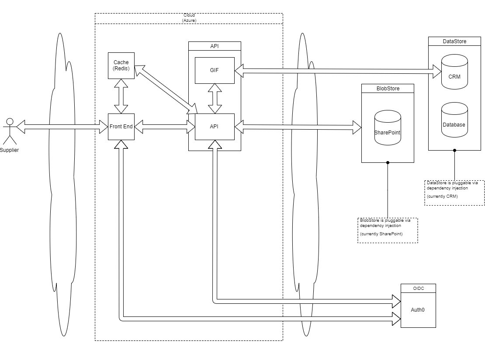

# High Level Design

The _Buying Catalog_ is a classic three tier application:
* user interface aka front end
* business rules aka logic (_API_ in the diagram)
* data storage aka datastore/blobstore

Not shown in the diagram for the sake of clarity are:
* Web Application Firewall (WAF)
* load balancer
* nginx
* logging
* monitoring

