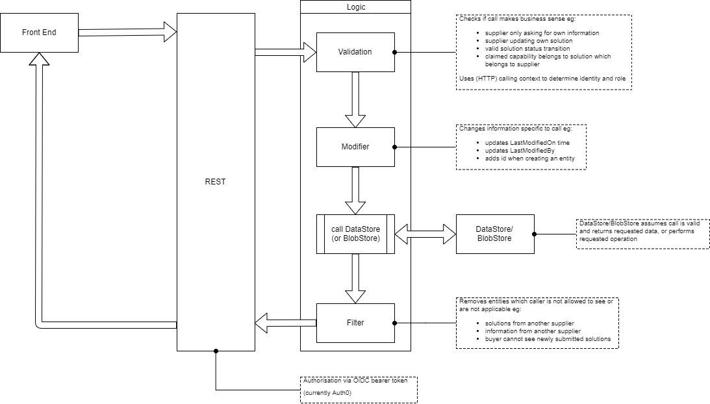

# Low Level Design - API

Currently, unit tests only exist to capture business rules for the following layers:
* validation
* modifier
* filter

There are no unit tests for the RESTful layer as this does not provide any value.

There are limited unit tests for bearer token authentication.

There are no unit tests for any of the DataStore implementations (CRM or database).  Similar comments apply to the BlobStore implementation (SharePoint).

There are some system tests for the CRM implementation of the DataStore but these are not run regularly as they are intrusive to other (concurrent) CRM users.
