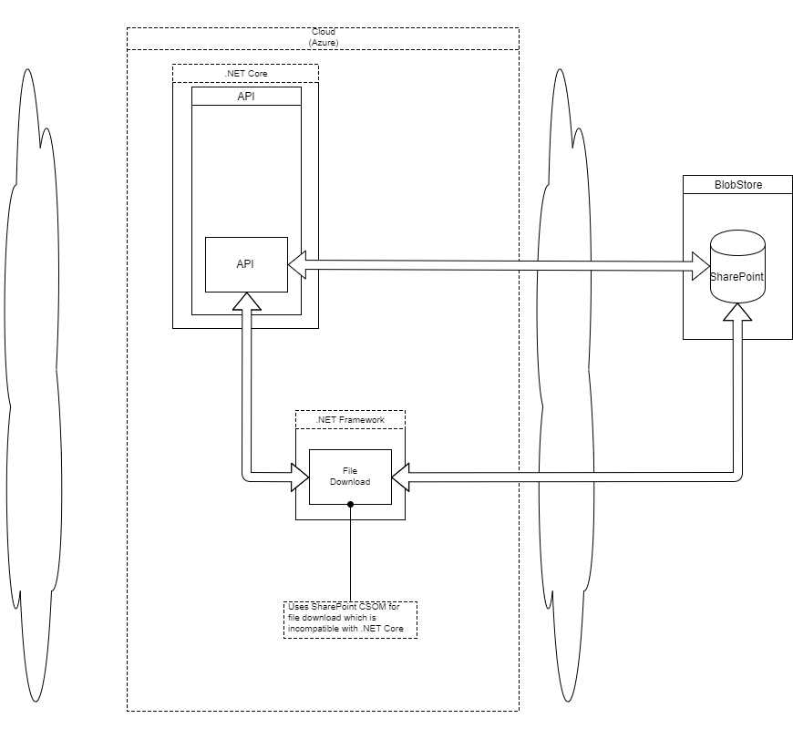

# High Level Design

Extensive functionality to manipulate _SharePoint_ is available through _Microsoft CSOM_ (Client Side Object Model) library.  Unfortunately, this is not available for .NET Core.  However, we have found a third party recompile of this library for .NET Core.  This supports all of the functionality we require *except* downloading files using a _SharePoint Add-in_ credentials.  Note that downloading a file with a _SharePoint_ username/password combination works in .NET Core but this is a security/admin risk as the account may expire or be compromised.

The current workaround is have a separate .NET Framework (RESTful service) which performs the downloading using _SharePoint Add-in_ credentials.
