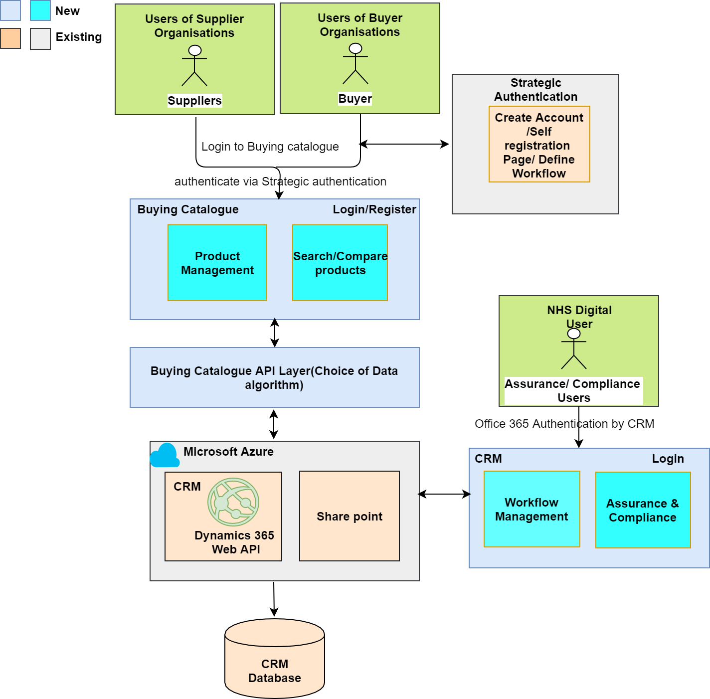

# High Level System Architecture

Buying catalogue is a web based application that will provide a full end-to-end service for suppliers to enter onto the catalogue to on-board their products and capabilities, and also be removed for non-compliance. 
User/purchaser will interact with the Buying Catalogue for searching required products which will interrogate the capabilities and standards data model to return results for the user/purchaser to review and action
The Buying Catalogue is also aligned with current NHS Digital Strategy to digitise the TOM process and create a front door CRM for users of NHS Digital services.

It will allow new framework model which will be refreshed and iterated regularly (every 24 months), so that it will open the market for potential new suppliers and allows it to reflect latest user needs.

It will can provide procure mechanism to manage GP market and tackle existing issues(like duopoly, barriers, market opening).

## Login and registration to Buying catalogue:
Users like suppliers and buyers who are coming to register on buying catalogue application, can be redirected to  self registration web page of Strategic Authentication, which will then create user account for these users. 

When suppliers or buyers(NHS/Non-NHS) login to buying catalogue using user  account created by Strategic Authentication system, strategic authentication will authenticate these users with defined roles & permissions in Strategic Authentication.

Hence buying catalogue need to integrate with Strategic Authentication system for single sign on authentication.

Strategic Authentication is the the existing smart card-based authentication  system for NHS employees.

## Microsoft Dynamics CRM & Database:
Dynamics CRM is already used by HSCN, NHS WIFI and other more within NHS , which allows to use existing master data entities storage like Users, Contacts & Organisations for buying catalogue.
Also current CRM provides good work flow management, Management Information as part of existing product which is one of the key requirements for buying catalogue.
Hence considering re usability of Data & systems, buying catalogue can use existing Dynamics CRM as its data storage.

## Product Management, Search & compare products:
Current CRM can not build new screens for third party users like suppliers or buyers(Non-NHS) based on rule that CRM only allows access to NHS digital users.

Hence Buying catalogue can develop product management & Search/ compare product screens on CRM.

CRM can develop web services to store / update  users, product data in CRM.  Choice of Data alogoriths / Search API layer  can be developed buying catalogue team on CRM web layer to allow buyers to search and compare product data.

## Workflow management and assurance / compliance:
CRM can build workflow management and assurance / compliance screens for buying catalogue which will be managed by NHS Digital users only.

NHS Digital users can be authenticated by CRM using Office 365 authentication. New NHS Digital users will be assigned security licences by CRM to access workflow management and assurance / compliance.

All workflow data will be stored in CRM and can be accessed via web services provided by CRM. 

## SharePoint Data storage:
Assurance and compliance team can use existing share point for storing requirements traceibility matrix sheets and evidences against requirements 

## ODS system:
Currently CRM is not integrated with ODS but there is proposal of project to integrate ODS data with CRM. Hence  buying catalogue can capture required ODS data by web services available with ODS system. 

CRM can develop web services to capture this ODS data via buying catalogues user registration screens.

Note: CRM can develop web services for buying catalogue to integrate with any system.